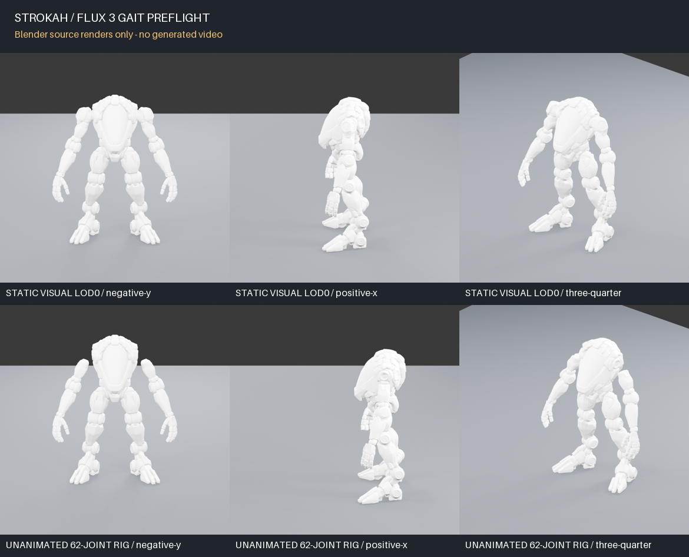
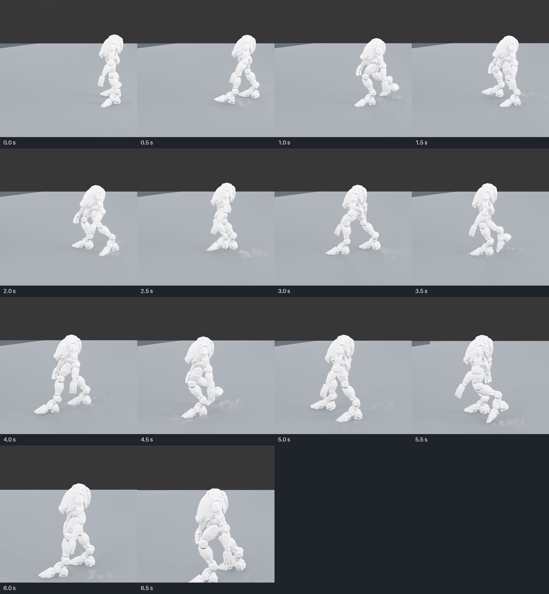
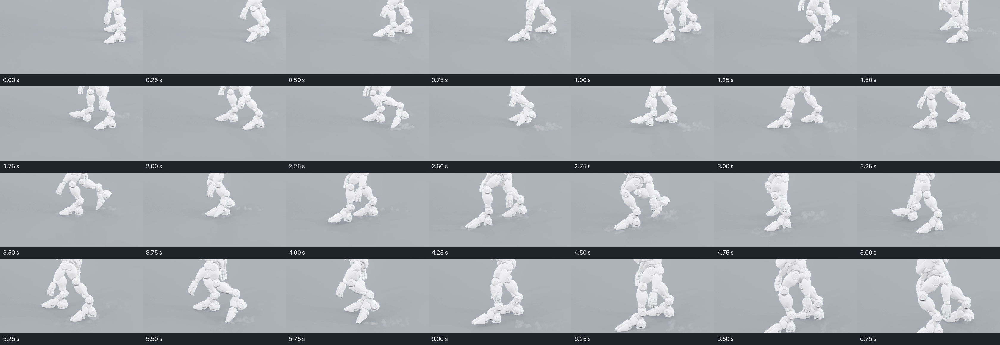
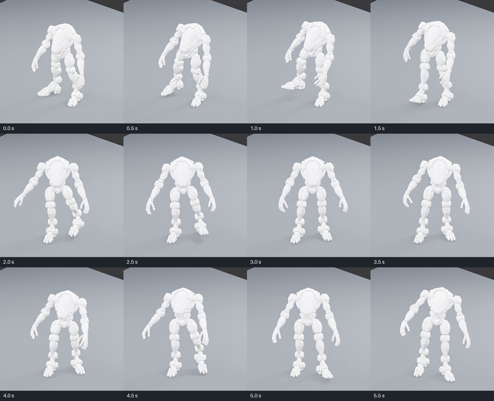
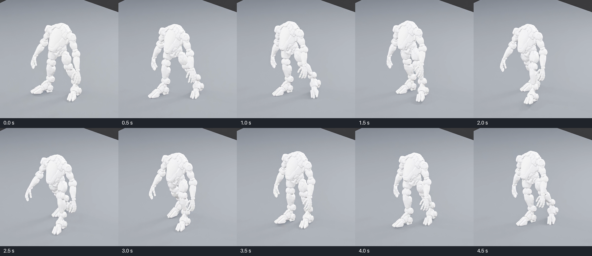
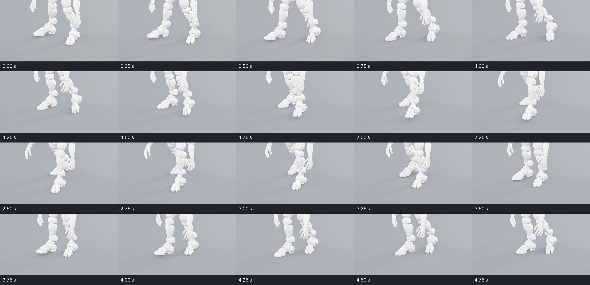

# FLUX 3 gait reference: local preflight

## Industrial side-on take

[Watch the seven-second industrial MP4 with audio](strokah-flux3-industrial.mp4)

The [full-frame manifest](industrial-full-frames/manifest.json) records 14
uncropped 960 x 960 PNGs, sampled every half-second. These preserve the
whole mech, pose, camera view, and floor context for later keyframe review.
The foot crops below are diagnostic enlargements only; they are not the
reference frames or BFL inputs.

The [third exact prompt](request-industrial.json) uses a new side-on render
with open runway on the left, asks for lateral travel and slow hydraulic
steps, and requests native audio. BFL job
`015e9481-a69d-484d-a951-6d2c8df7a18f` returned a real 7.04-second,
960 x 960, 24 fps H.264/AAC MP4. It crosses the frame through several
steps, with knee compression and dust on contact. This is much closer to an
industrial jaunt than the earlier takes. The cadence still feels too quick
and light for a colossal machine, and the apparent planted feet drift across
successive frames. It is a visual direction, not a foot-contact reference.

## Heft prompt draft

[Watch the six-second heft MP4](strokah-flux3-heft.mp4)

The [second exact prompt](request-heft.json) asked for two slow, massive
strides, a firm planted foot, body compression at impact, and delayed arm
swing. BFL job `0de34b76-fd69-48f5-8514-5e5dc2a94705` returned a real
6.04-second, 960 x 960, 24 fps draft. The first stride has a clearer lifted
foot and body dip, and Strokah stays recognizable. The body turns toward the
camera; the later motion mostly steps in place, and the contact foot still
slides. This is a useful visual direction, but not an accepted gait reference.

## Generated candidate

[Watch the FLUX 3 draft MP4](strokah-flux3-gait.mp4)

The replacement BFL job `8fe9d612-c9dd-47b4-b781-cd3ee19ba2d0` returned
a real 5.04-second, 960 x 960, 24 fps H.264 MP4. Its SHA-256 is
`f9feb49e190ea902b737c1f187083f1d7638b90de14722819ba344e5633ec588`.
The shell, shoulder and leg joints, articulated hands, and split feet remain
recognizably Strokah. Fine mechanical detail softens as the limbs move.

The legs alternate and the feet reach toe-down poses. The apparent contact
feet skate across the floor instead of holding a stable planted position;
there is little forward travel and no clearly readable heel-to-toe weight
transfer. This draft proves the live image-to-video integration, but it is
**not accepted as the pinned gait reference**.

## Inputs and method

The two source GLBs came from the exact S3 versions pinned in
`plugins/pacific-gym/fixtures/strokah-source.json`. The static visual has no
skin or animation. The separate rig reference has 62 joints and no animation.
Blender 5.2.1 LTS rendered five views of each without changing either source.
`Terrain_Walk_Test` and `Icosphere` were hidden for rig **renders only** so
the body fills the frame. The render receipts contain each image's hash.

The [exact request](request.json) uses the visual three-quarter render as the
opening frame of a five-second FLUX 3 Video `i2v` draft at `hd`, 1:1, silent.
The prompt asks for an alternating, weighty forward walk and visible planted
feet. Other rendered views support local identity review; the current BFL API
uses supplied `keyframes` as frames in the generated video, so feeding the
other camera angles would force a view change rather than serve as independent
identity references. The endpoint's `latest` version is not a fixed model
revision, and the actual model revision cannot be established without a run.

Run `sh scripts/accept-flux3-gait.sh` for the local hash and request preflight.
With an authorized BFL API key in `BFL_API_KEY`, run
`sh scripts/accept-flux3-gait.sh --live` to submit once, poll or resume that
job, and save the returned MP4 under `.pacific-gym/flux3/`. The submission ID
is stored so rerunning the command does not create another billable job.
On macOS, immediately after copying the key, run
`sh scripts/accept-flux3-gait.sh --live-from-clipboard` to use it without
placing the key in a shell command or environment variable.
The current command recognizes the archived, hash-verified video and exits
without another submission.

The local preflight passed on 2026-09-25. After the key was copied to the
clipboard, BFL accepted one draft submission. The client then rejected BFL's
returned polling host before it saved the job ID, so that result cannot be
retrieved. The client now saves the submission before validating that the
polling URL is HTTPS. The replacement call returned the video reviewed above.

API contract: [BFL Video docs](https://docs.bfl.ai/flux_3/flux3_video),
[FLUX 3 endpoint](https://docs.bfl.ai/api-reference/utility/generate-a-video-with-flux-3).
